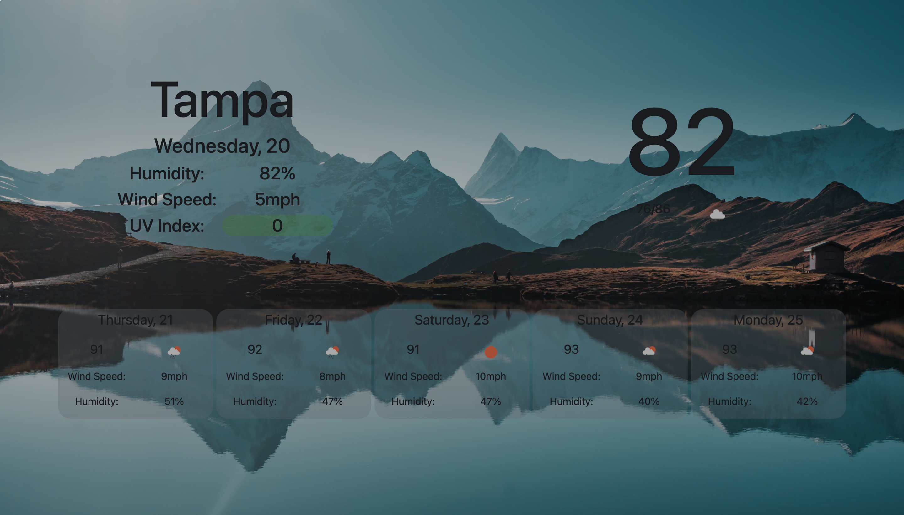

# Weather Dashboard

## This is a website created to view the weather for any city in the world in real time using OpenWeather API
## When searching a city, you can see the present and future weather conditions.
## For the current weather, you can see temperature, humidity, wind speed, UV index and an icon representing the type of weather.
## For the forecast, you can see the temperature, wind speed, humidity and also an icon representing the type of weather for that day.
## Your search history gets stored in local storage for convenience so you can click on a city previously searched, and the website will take you to the weather dashboard for such city.
## Finally the UV index section, displays a color coded background depending on the severity of such number.

### [Weather Dashboard Link](https://pargasparedes.github.io/WeatherDashboard/)

### 
### 
